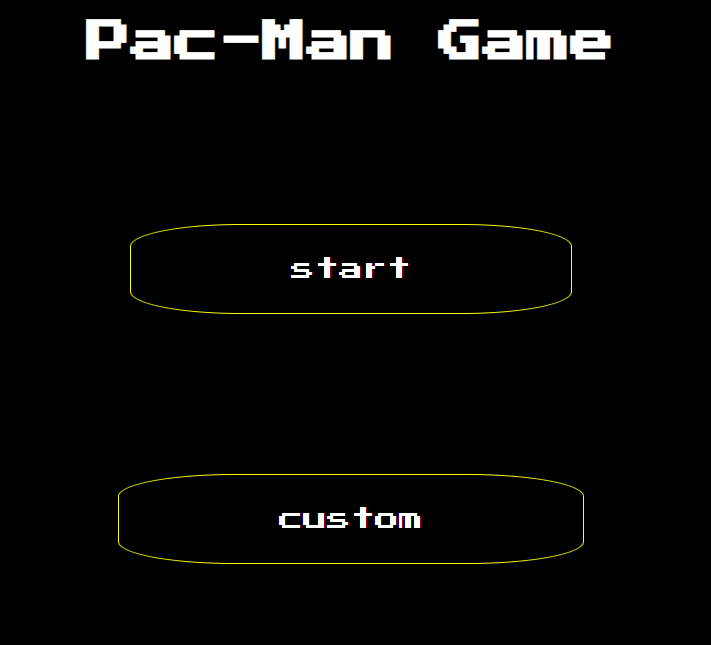
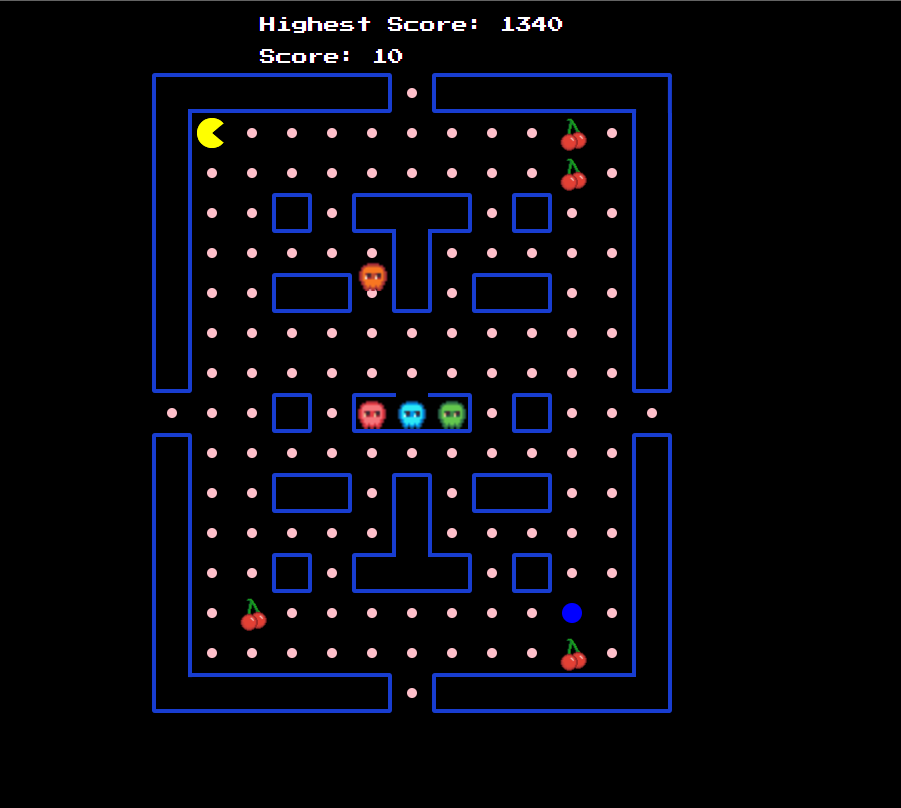
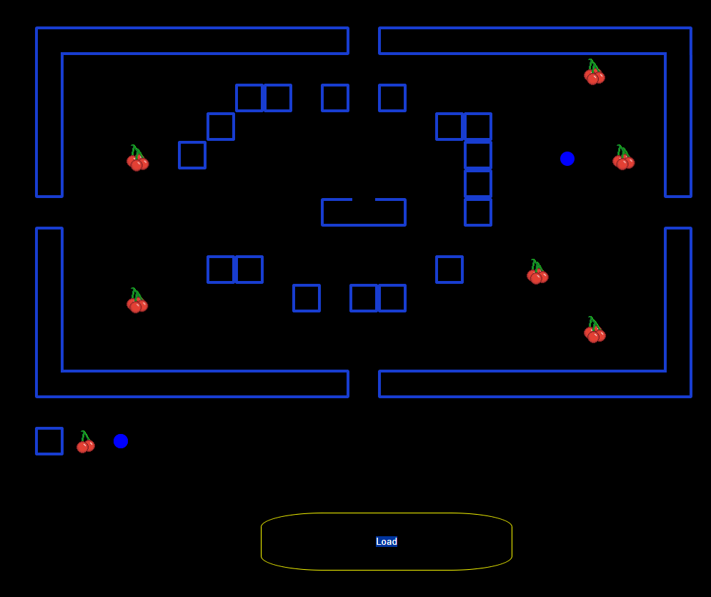

# Pac-Man Game

A traditional Pac-Man game built using the HTML5 canvas element.

## Features

- **Player Movement:** The player can move in four directions: up, down, left, and right.
- **Power-Ups:** Special power-ups are available that make the ghosts scared and vulnerable to being eaten by Pac-Man.
- **Special Items:** Collect special items to increase your score.
- **Ghost Spawning:** Ghosts spawn at different times from a central cage.
- **Ghost Behavior:** Ghosts exhibit random movement behavior.
- **Chasing Ghosts:** Pac-Man can chase and eat ghosts when they are in the scared state.
- **Sound Effects:** Enjoy sounds while eating pellets, items, power-ups, and a unique sound for ghosts.
- **Start and End Screens:** Includes a start screen to begin the game and an end screen to show the game result.
- **Pause and Play:** You can pause and resume the game anytime.
- **Custom Map Builder and Loader:** Create and load your own custom maps for a personalized gaming experience.

## screenshots




## Installation

1. Clone the repository:

    ```sh
    git clone https://github.com/sammanamgain/Pac_Man_v2
    ```

2. Install the dependencies:

    ```sh
    npm i
    ```

3. Run the project:

    ```sh
    npm run dev
    ```

## Author

- **Name:** Samman Babu Amgain
- **Roll No:** 27

Enjoy playing Pac-Man!
